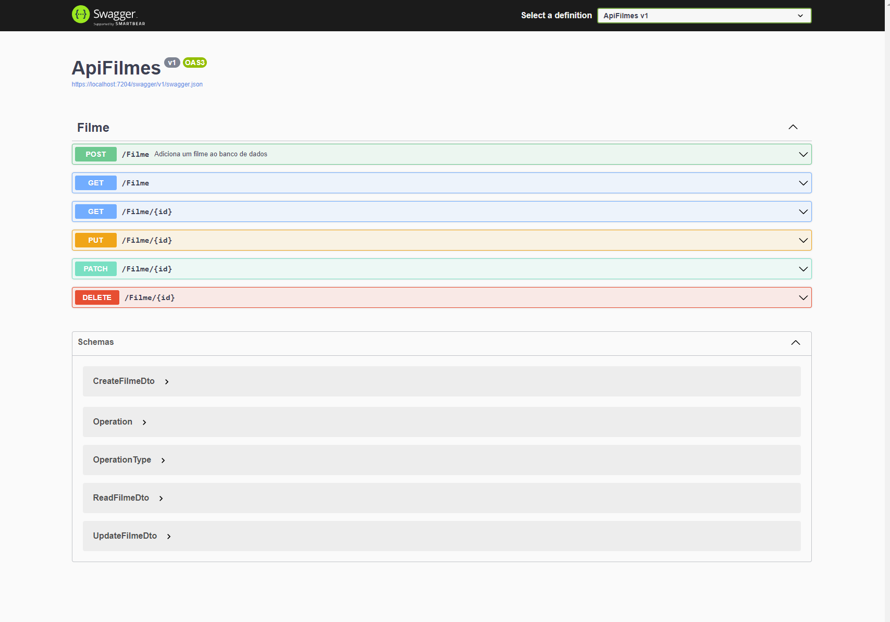

# ASP .NET Core Web API 

## Um projeto backend de uma API para filmes.

### Desenvolvido em:
1. ASP .NET Core com C#
2. MySQL
3. Swagger

### Conhecimentos Adquiridos:
1. MVC (Model View Controller)
2. DB Connection (MySQL)
3. Utilização de AutoMapper(Context e DTO)

